## OS 161 Scheduling Assignment

## Carter Tabin and Mateusz Doda

## 5/1/

## Design:

## Round Robin:

This scheduler uses a round robin approach to schedule threads. Each thread is given equal
priority and the scheduler allocates a set amount of time for each process before pausing that
process and moving on to the next in line. This is a preemptive algorithm and gives each process
a chance to run equally. This was implemented by using the clock to switch which was the
current process every x amount of time. This scheduler performed the worst out of the three that
were implemented. The benefit of it is that it is easy to implement and is inclusive of all the
processes attempting to run.
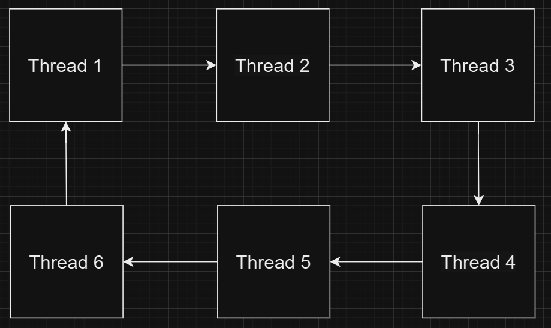
Each arrow represents X amount of time passing and then scheduler switching the main thread.
When a thread is done with its job, it gets removed from the cycle.
FIFO:
This scheduler uses a First In First Out approach to schedule threads. In this approach, threads
are processed in the order that they were received. Once a process finishes, the scheduler moves
on to the next process in line. This algorithm is not preemptive and it does not give all the
processes an equal chance. However, it is easy to implement and works well when all the
processes have similar run times. This scheduler was faster than round robin in the benchmark

tests we did. This scheduler works best when processes run for similar times, but would not be as
effective when the runtime is unknown.
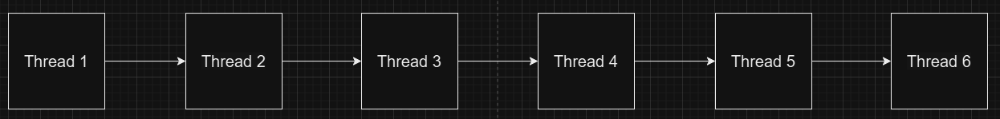
Each arrow represents the scheduler switching to a new current process when the current one is
finished.
When a thread is done with its job, it gets removed from the path and the next thread in line
starts.

## MLFQ:

This scheduler used a Multilevel Feedback Queue approach to schedule threads. In this
approach, the priority of threads are ranked based on if they are interactive and/or need input to
run or if they do not. This is a preemptive algorithm whose goal is to order threads in an order
that is most efficient to complete. This was implemented using a doubly linked list of all of the
threads. Each thread in this list is assigned a priority based on what is known about it. The
highest priority item is then assigned as the head of the linked list and is run. This scheduler was
the fastest of the three and allowed for the most efficient use of CPU resources. This scheduler
works best when there is a mix of threads that do and do not require user input.
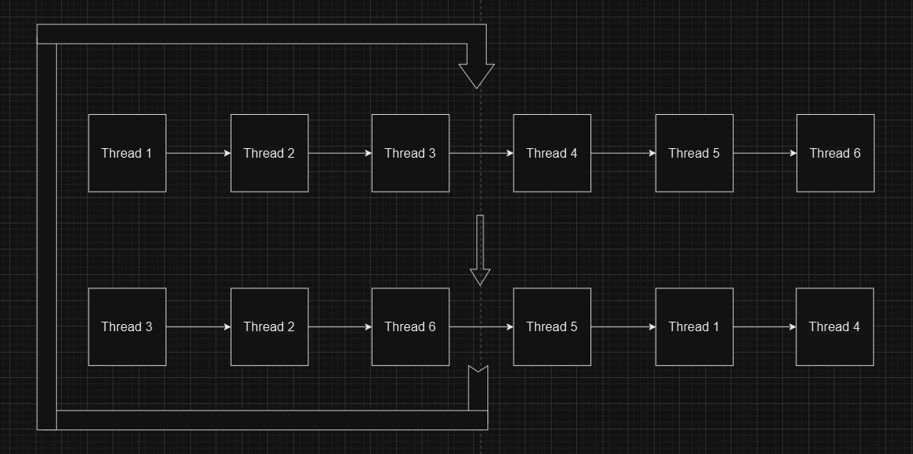

The threads all start with priority 1.
They are then assigned priorities based on the scheduling algorithm.
Every so often, all of the threads are reassigned a priority of 1.
Once a thread is finished with its job, it is removed from the cycle.

# Implementation:

## FIFO:

To implement FIFO, we simply changed the hardclock values in clock.c
(SCHEDULE_HARDCLOCKS and MIGRATE_HARDCLOCKS) to a large arbitrary number so
that the round robin scheduler that was already implemented never had the chance to switch to
another thread, therefore making it first in first out.
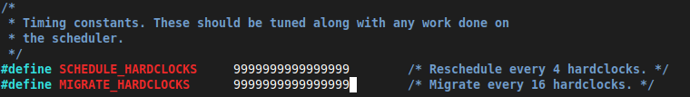

## MLFQ (Multilevel Feedback Queue):

Following instructions given by the website provided, we first implemented priority levels to
threads by first updating the header file thread.h to have a priority parameter.

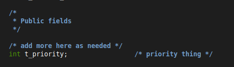
Our implementation of priority included low priority (0), medium priority (1), and high priority
(2), with each thread being initialized to 1.
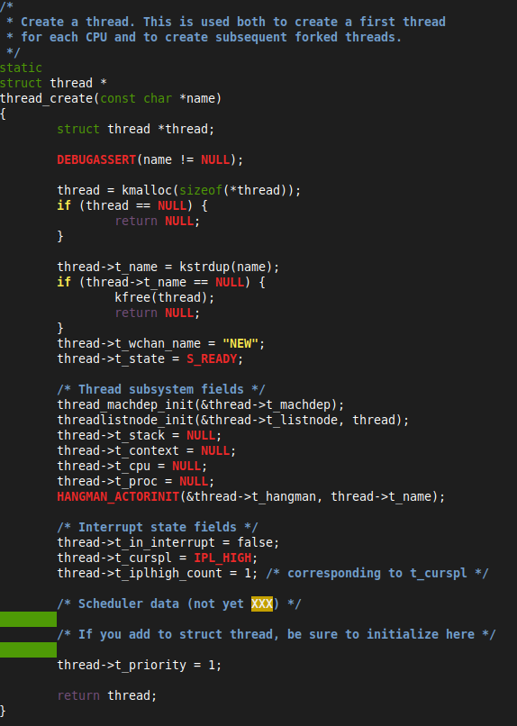

The next step was to allow each thread to change priority depending on if it was sleeping or was
ready. Being ready meant it would become a lower priority due to it not waiting on input from
the user, and sleeping programs would become a higher priority due to waiting on input. We had
to also make sure to not allow a thread to go beyond the priority range with simple if statements
before updating their priority.
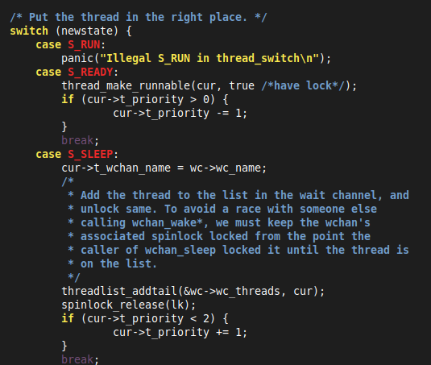

To actually allow these threads to be scheduled according to their priority level, we updated the
schedule function to go through the cpu’s currently running thread linked list. It would iterate
through the linked list looking for a high priority thread to move to the head of the list. If none
are found, it would iterate again looking for a medium priority thread to move to the head of the
list. If none are found, it means that all threads in the linked list are low priority and the order
isn’t changed. This function also addresses if the linked list is empty to prevent reading/writing
to an empty linked list.
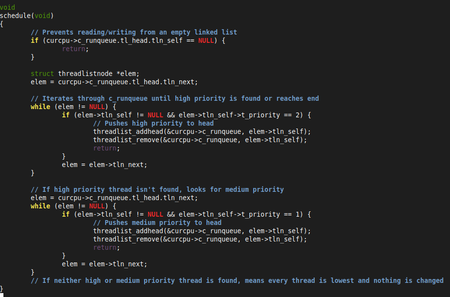

We then implemented a reset_priority function, which would run periodically (every 32 ticks) to
reset all threads to a medium priority. This is to prevent any high priority thread from causing
remaining threads to starve.
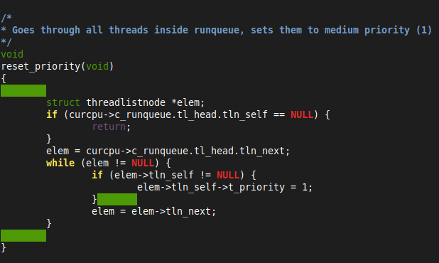
Added if statement to hardclock in clock.c to allow reset_priority to run every 32 ticks.
(SCHEDULE_HARDCLOCKS and MIGRATE_HARDCLOCKS were reset to their default
values for MLFQ)

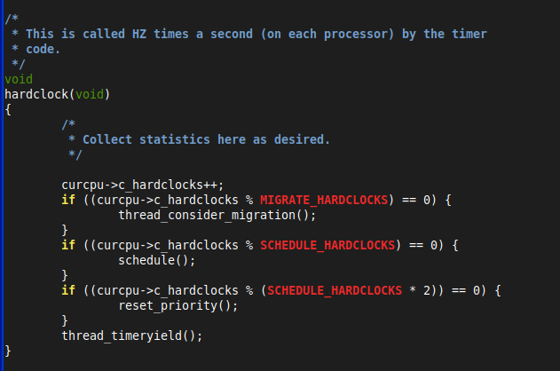

## Benchmarks:

To run the tests, we increased the memory of os161 to 4MB instead of 512 KB
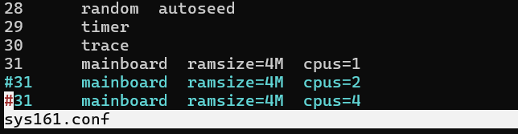

## Add:

## Round-Robin:

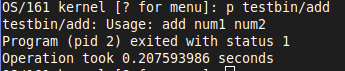
FIFO:

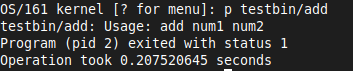
MLFQ:
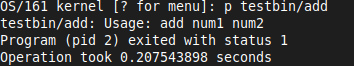

## matmult:

Round-Robin:
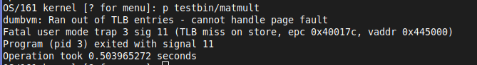
FIFO:
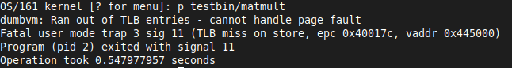
MLFQ:
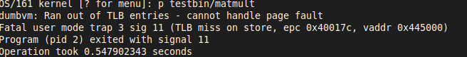

## hog:

Round-Robin:
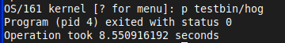
FIFO:

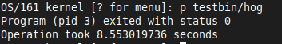
MLFQ:
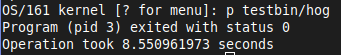

## farm:

Round-Robin:
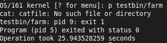
FIFO:
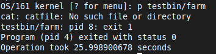
MLFQ:
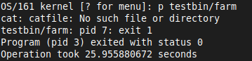

## schedpong:

Round-Robin:

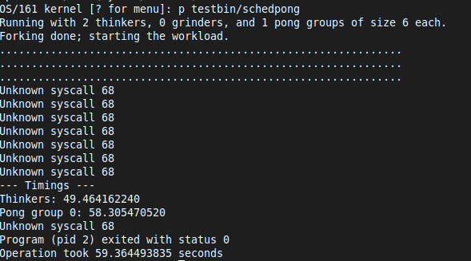
FIFO:
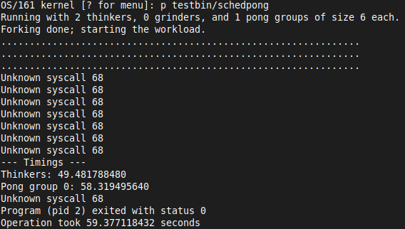
MLFQ:

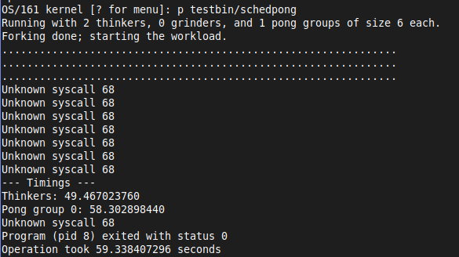

